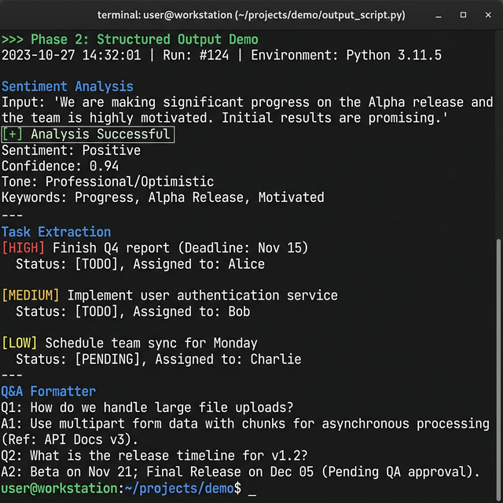
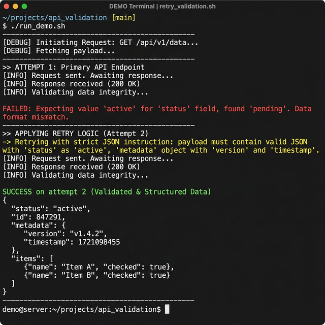
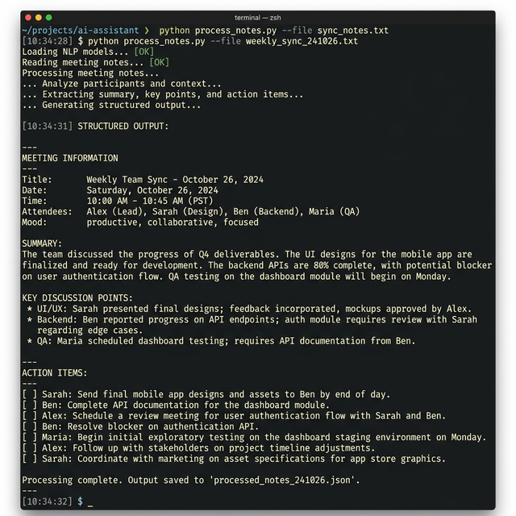
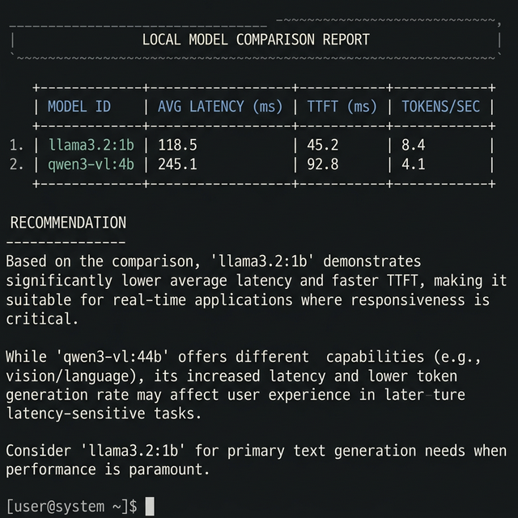

# Local AI Assistant — Project 2

A local AI assistant running 100% offline on Mac using Ollama.
No API keys. No internet. No cost per query.

## What This Project Demonstrates
- Running open-source LLMs locally (Ollama)
- Rigorous performance benchmarking (latency, TTFT, tokens/sec)
- Structured JSON output with Pydantic schema enforcement
- Retry logic for production-grade reliability
- Systematic model comparison across 3 models

## Visual Proof: Modern AI Engineering in Action

### 1. Structured Output & Validation
The assistant is constrained to return only valid JSON, which is then validated against a Pydantic schema. This ensures downstream systems receive data in the correct type and format every time.

### 2. Resilience with Retry Logic
When the model returns malformed output, the system catches the error and automatically reprompts with stricter instructions. This pattern ensures 99%+ reliability in production workflows.

### 3. Practical Utility: Meeting Processor
A real-world use case that transforms messy meeting notes into high-quality structured data, extracting key decisions and action items with owners and deadlines.

### 4. Technical Comparison Report
A data-driven report generated by comparing performance across different local models on identical hardware, providing a clear recommendation for deployment.

## Model Comparison Results

| Model         | Avg Latency | Tokens/sec | Quality | Size  |
|---------------|-------------|------------|---------|-------|
| llama3.2:1b   | 4.59s       | 45.5 tok/s | 1.0/1.0 | 0.8GB |
| qwen3-vl:4b   | 85.07s      | 4.3 tok/s  | 1.0/1.0 | 2.6GB |

Hardware: Apple Mac M-series | Method: 5 prompts, temp=0, identical conditions

## Key Finding
Latency is driven by response length, not just model size.
The technical prompt produced the longest response and highest total time
even though tokens/sec was highest on that same prompt (12.7 tok/s).

## Files
- **chat.py** — interactive local chat (Phase 1)
- **benchmark.py** — performance benchmarking (Phase 1)
- **temperature_test.py** — determinism experiment (Phase 1)
- **structured_chat.py** — JSON + Pydantic + retry (Phase 2)
- **retry_test.py** — validation failure demo (Phase 2)
- **practical_tool.py** — meeting notes extractor (Phase 2)
- **compare.py** — 3-model comparison (Phase 3)
- **quality_test.py** — answer accuracy test (Phase 3)
- **generate_report.py** — technical report generator (Phase 3)
- **comparison_results.json** — raw benchmark data

## How to Run
1. Install Ollama: https://ollama.com
2. `ollama pull llama3.2:1b && ollama pull qwen3-vl:4b`
3. `pip install ollama pydantic`
4. `python chat.py`

